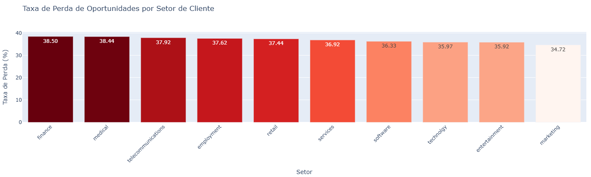
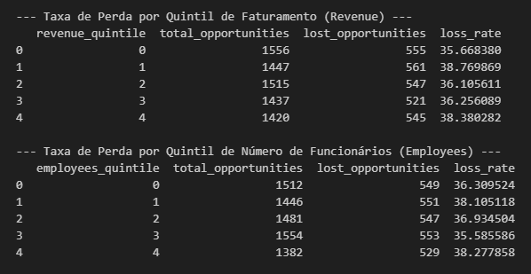
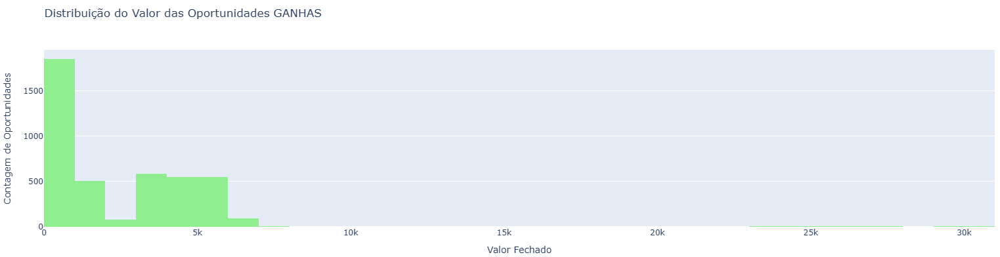
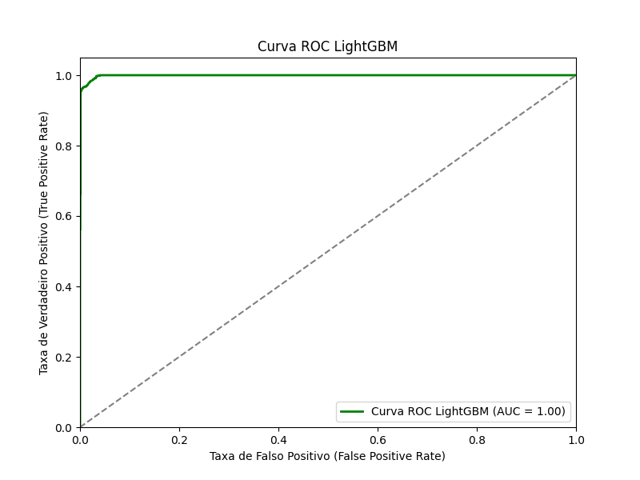

# crm_opportunity_loss_prediction

## Visão Geral do Projeto

Este projeto, atualmente **em desenvolvimento**, visa criar uma solução de Machine Learning para prever a probabilidade de uma oportunidade de venda ser perdida em um cenário de **vendas B2B complexas e de alto valor agregado**.

Em ambientes de vendas B2B, a perda de uma única oportunidade pode representar um impacto financeiro significativo. Identificar proativamente quais oportunidades estão em risco de não serem convertidas permite que as equipes de vendas e a gerência intervenham estrategicamente, realocando esforços e recursos para maximizar as taxas de sucesso.

Este repositório demonstrará o ciclo completo de um projeto de Ciência de Dados, desde o entendimento do negócio e preparação dos dados, até a modelagem e a simulação de deploy de um modelo preditivo.

---

## 1. Business Understanding (Entendimento do Negócio)

### 1.1. Problema de Negócio

Em vendas B2B, especialmente aquelas com alto valor agregado e ciclos longos, a capacidade de prever o desfecho de uma negociação é crucial. O principal problema a ser abordado é a **perda de oportunidades de vendas**, que impacta diretamente a receita e a eficiência da equipe de vendas ao gastar tempo em propostas que não se concretizarão.

### 1.2. Objetivo do Negócio

O objetivo é **desenvolver um sistema preditivo que identifique proativamente oportunidades de vendas com alta probabilidade de serem perdidas**. Isso permitirá que:

* A equipe de vendas receba **alertas precoces** sobre oportunidades em risco.
* Sejam implementadas **ações preventivas** (ex: ofertas especiais, reuniões estratégicas, realocação de vendedores, etc.) para tentar reverter a situação.
* Haja uma **otimização do tempo e recursos** da equipe, focando nos casos mais promissores ou naqueles que necessitam de intervenção crítica.

### 1.3. Impacto dos Erros de Predição

Em nosso cenário de vendas B2B de alto valor:

* **Falso Negativo (Mais Crítico):** O modelo falha em prever uma perda que de fato acontece. O custo aqui é a **perda total da venda**, um impacto financeiro considerável para a empresa. Nossa prioridade será **minimizar falsos negativos** para garantir que a maioria das oportunidades em risco seja sinalizada.
* **Falso Positivo (Menos Crítico):** O modelo prevê uma perda, mas a oportunidade é ganha. Embora possa gerar custos (ex: descontos desnecessários, esforço extra da equipe, campanhas direcionadas), esses custos são considerados menores do que a perda completa de uma venda de alto valor.

---

## 2. Data Understanding (Entendimento dos Dados)

### 2.1. Visão Geral dos Dados e Variável Alvo

O projeto utiliza um conjunto de dados fictício de **oportunidades de vendas B2B**, obtido do Kaggle, para simular um cenário de negócio real. Os dados são fornecidos em quatro tabelas principais:
* `sales_pipeline`: Contém informações detalhadas sobre cada oportunidade, como ID, agente de vendas, produto, conta, estágio do negócio, datas de engajamento e fechamento, valor de fechamento e o status (`target`).
* `accounts`: Detalhes sobre as contas dos clientes, incluindo setor, ano de fundação, faturamento, número de funcionários e localização.
* `products`: Informações sobre os produtos envolvidos nas oportunidades, como série e preço de venda.
* `sales_teams`: Detalhes sobre a estrutura da equipe de vendas, incluindo agentes, gerentes e escritórios regionais.

Todas essas tabelas foram unificadas em um único DataFrame (`df_eda_consolidated`) para facilitar a análise exploratória. A **variável alvo** para o nosso modelo preditivo é a coluna `target`, onde `0` indica uma oportunidade **ganha** e `1` indica uma oportunidade **perdida**.

### 2.2. Principais Insights da Análise Exploratória de Dados (EDA)

A análise exploratória revelou diversos padrões e fatores que podem estar associados à perda de oportunidades de vendas:

#### 2.2.1. Análise por Características do Cliente

Avaliamos como as características dos clientes impactam o desfecho das oportunidades:

* **Setor:** Identificamos que **Finanças**, **Médico** e **Telecomunicações** são os setores com as maiores taxas de perda de oportunidades. Em contraste, setores como o Marketing e de Entretenimento apresentaram as menores taxas de perda.



* **Porte da Empresa (Faturamento e Número de Funcionários):** A análise revelou que as taxas de perda se mantêm **relativamente consistentes** entre os diferentes portes de empresa, variando em uma faixa estreita. No entanto, observamos uma tendência de taxas ligeiramente mais elevadas para empresas nos **segundo e quinto quintis** tanto de **faturamento quanto de número de funcionários**, indicando que esses segmentos específicos podem apresentar desafios distintos no ciclo de vendas.



#### 2.2.2. Análise por Características do Produto

Nesta seção, exploramos como as características dos produtos se relacionam com a perda de oportunidades:

* **Produto e Série:** A taxa de perda varia entre os produtos, com o **"GTK 500"** apresentando a maior taxa de perda (~42.50%), sugerindo que pode ser o mais desafiador de vender. A série de produto principal **GTK** mostrou a maior taxa de perda (~42.50%), indicando que a série em si é pode ser um diferencial significativo na probabilidade de perda, assim como o produto específico dentro da série.


* **Preço de Venda (`sales_price`):** A análise do preço de venda não revelou uma correlação linear forte com a taxa de perda. Oportunidades com preços muito altos ou muito baixos não se mostraram consistentemente mais ou menos propensas a serem perdidas, indicando que o preço, isoladamente, pode não ser o fator decisivo para o desfecho da venda.


#### 2.2.3. Análise por Desempenho da Equipe de Vendas

Avaliou-se o impacto do desempenho da equipe de vendas nas taxas de perda:

* **Agente de Vendas (`sales_agent`):** Há uma **variação significativa no desempenho individual** dos agentes. Agentes como **Lajuana Vencill (~43.09%)**, **Gladys Colclough (~42.59%)** e **Donn Cantrell (~42.55%)** apresentaram taxas de perda notavelmente mais altas, indicando possíveis áreas para treinamento ou revisão de estratégias. Em contrapartida, agentes como **Hayden Neloms (~30.20%)** e **Maureen Marcano (~32.98%)** demonstraram performance superior, cujas melhores práticas poderiam ser replicadas.


* **Gerente (`manager`):** A maioria dos gerentes apresentou taxas de perda similares (entre 35.68% e 37.64%), mas **Rocco Neubert** se destacou com a maior (~38.36%). Isso sugere que a equipe sob sua gerência pode enfrentar desafios específicos ou que suas abordagens necessitam de reavaliação.


* **Escritório Regional (`regional_office`):** A região **East (Leste)** apresentou a maior taxa de perda (~37.49%), enquanto a região **West (Oeste)** teve a menor (~35.90%). Essa disparidade regional pode indicar a influência de fatores locais como concorrência ou características de mercado.


#### 2.2.4. Análise Temporal e de Valor

Esta seção investigou a dinâmica do tempo e do valor das oportunidades:

* **Duração da Oportunidade (`opportunity_duration_days`):** Oportunidades que foram **perdidas** tenderam a ter um ciclo de vendas **mais curto** (média de ~41.48 dias) em comparação com as oportunidades **ganhas** (média de ~51.78 dias). Isso pode sugerir que negociações que se estendem um pouco mais ou que demandam um engajamento mais prolongado têm maior probabilidade de sucesso.


* **Valor da Oportunidade (`close_value`):** Para as oportunidades **ganhas (target=0)**, o valor médio é de aproximadamente **$2.360,91**, com uma mediana de $1.117,00, indicando que, embora a maioria das vendas seja de valores menores, há uma cauda longa de negócios de alto valor que elevam a média. Surpreendentemente, as oportunidades **perdidas (target=1)** apresentam um valor médio potencial ligeiramente maior, de **$2.424,05**, e uma mediana de $1.080,05. Essa similaridade nas distribuições de valor entre oportunidades ganhas e perdidas sugere que o potencial de valor em si pode não ser o principal fator de distinção entre sucesso e fracasso, e que outros elementos devem influenciar o desfecho da venda.




---

## 3. Data Preparation (Preparação dos Dados)

Nesta fase, os dados foram transformados e limpos para serem adequados à modelagem preditiva, garantindo a qualidade e o formato necessário para os algoritmos de Machine Learning. As principais etapas realizadas foram:

* **Tratamento de Valores Ausentes:**
    * Para colunas categóricas como `subsidiary_of`, `sector`, `office_location`, `account` e `series`, os valores `NaN` foram preenchidos com marcadores como `Not_Subsidiary` ou `Unknown_` (e.g., `Unknown_Sector`), permitindo que essas informações fossem mantidas e codificadas posteriormente.
    * Para colunas numéricas (`revenue`, `employees`, `year_established`, `sales_price`), os valores ausentes foram imputados utilizando a **mediana**, uma abordagem robusta que minimiza o impacto de *outliers*. A coluna `close_value` já havia sido pré-tratada no processo de Data Understanding com base no potencial de valor de oportunidades perdidas, não necessitando de intervenção adicional aqui.

* **Engenharia de Features:**
    * Foi criada a feature **`opportunity_duration_days`**, calculada como a diferença em dias entre `close_date` e `engage_date`. Para garantir a consistência, os valores `NaN` (resultantes de datas ausentes) e durações não positivas (`<= 0`) foram preenchidos com a **mediana das durações válidas e positivas** existentes no dataset, tornando a feature robusta para a modelagem.

* **Codificação de Variáveis Categóricas:**
    * Todas as features categóricas (`subsidiary_of`, `sector`, `office_location`, `sales_agent`, `manager`, `regional_office`, `product`, `series`, etc.) foram convertidas em um formato numérico através de **One-Hot Encoding** (`pd.get_dummies`). O parâmetro `drop_first=True` foi aplicado para evitar a multicolinearidade e otimizar a representação das categorias.

* **Remoção de Colunas Desnecessárias:**
    * Colunas identificadoras únicas (`opportunity_id`, `account`) e as colunas de data originais (`engage_date`, `close_date`) foram removidas, pois suas informações já foram extraídas na `opportunity_duration_days` ou não são úteis para o treinamento do modelo.

* **Escalonamento de Variáveis Numéricas:**
    * As features numéricas (`year_established`, `revenue`, `employees`, `sales_price`, `close_value`, `opportunity_duration_days`) foram padronizadas utilizando **`StandardScaler`**. Este processo transforma os dados para terem média zero e variância unitária, o que é fundamental para o bom desempenho de muitos algoritmos de Machine Learning, especialmente aqueles baseados em distância ou otimização por gradiente.

* **Divisão em Conjuntos de Treino e Teste:**
    * O dataset final, pronto para a modelagem, foi dividido em **conjuntos de treinamento (80%) e teste (20%)**. A variável alvo (`target`) foi utilizada para estratificação (`stratify=y`), assegurando que a proporção de oportunidades ganhas (`0`) e perdidas (`1`) fosse mantida consistentemente em ambos os conjuntos, o que é crucial para evitar viés em datasets desbalanceados.

* **Modelo Baseline:**
    * Um **modelo baseline** simples foi estabelecido, prevendo sempre a classe majoritária (oportunidade **ganha**, ou `target=0`). Este baseline servirá como um ponto de comparação mínimo para avaliar o desempenho dos modelos de Machine Learning mais complexos que serão desenvolvidos. Suas métricas de Recall para a classe minoritária (perdida) e F1-score foram, como esperado, zero.

---

## 4. Modeling (Modelagem)

Nesta fase, o foco foi no desenvolvimento e treinamento de um modelo de Machine Learning capaz de prever a probabilidade de uma oportunidade de venda ser perdida (`target=1`).

Inicialmente, foi testado um modelo de **Regressão Logística**. Apesar da sua simplicidade e interpretabilidade, a performance inicial foi insatisfatória, especialmente no que diz respeito à capacidade de identificar a classe minoritária (oportunidades perdidas), apresentando um **Recall de apenas 8% para a classe 1** e um **AUC-ROC de 0.5701**. Esses resultados indicaram que a Regressão Logística não era adequada para capturar a complexidade dos padrões no dataset e atingir os objetivos de negócio.

Dada a baixa performance do modelo inicial e a necessidade de um classificador mais robusto, foi tomada a decisão estratégica de transicionar para um algoritmo de **Gradient Boosting**. Especificamente, optou-se pelo **LightGBM (`lgb.LGBMClassifier`)**, conhecido por sua alta eficiência, velocidade e capacidade de lidar com datasets complexos e desbalanceados.

O modelo LightGBM foi configurado com `objective='binary'` para classificação binária, `metric='auc'` para otimização em problemas desbalanceados e, crucialmente, `is_unbalance=True` para dar maior peso à classe minoritária (`target=1`, oportunidades perdidas) durante o treinamento.

---

## 5. Evaluation (Avaliação)

A avaliação do modelo LightGBM revelou um desempenho **excepcional**, superando drasticamente o modelo baseline e a Regressão Logística. As métricas no **conjunto de teste** demonstraram a alta capacidade de generalização do modelo:

* **Precision (Classe 'Perdido' - 1): 97%**
* **Recall (Classe 'Perdido' - 1): 97%**
* **F1-Score (Classe 'Perdido' - 1): 97%**
* **Accuracy Geral: 98%**
* **AUC-ROC Score: 0.9987**

A **Matriz de Confusão** no conjunto de teste reforçou esses resultados:


Isso significa que, de 650 oportunidades perdidas reais, o modelo identificou **632 Verdadeiros Positivos** (um recall de 97%). Apenas **18 Falsos Negativos** ocorreram, o que é um resultado notável para o objetivo de minimizar a perda de oportunidades.

A **Curva ROC** abaixo ilustra a excelente capacidade de discriminação do modelo entre as classes 'ganha' e 'perdida', com uma área sob a curva (AUC) próxima de 1.0.



**AUC-ROC Score: 0.9987**

### 5.1. Análise de Overfitting e Validação Cruzada

Para garantir a robustez e a capacidade de generalização do modelo, foi realizada uma análise detalhada de overfitting e uma **Validação Cruzada Estratificada com 5 folds**.

A comparação das métricas entre o **conjunto de treino** (ex: AUC-ROC de 0.9998) e o **conjunto de teste** (AUC-ROC de 0.9987) mostrou uma diferença mínima, indicando que o modelo não está superajustado aos dados de treinamento.

Os resultados da Validação Cruzada corroboraram essa conclusão, apresentando médias de desempenho altamente consistentes em todas as divisões dos dados, com **desvios padrão extremamente baixos**:

* **Média Recall (Classe 'Perdido' - 1) no Teste/Validação: 0.9765 +/- 0.0037**
* **Média AUC-ROC no Teste/Validação: 0.9984 +/- 0.0004**

A consistência e os altos valores dessas métricas confirmam que o modelo LightGBM é **altamente robusto, generalizável** e atende (e supera) as expectativas para o problema de negócio de prever a perda de oportunidades de venda.

A visualização a seguir ilustra a distribuição dos scores de AUC-ROC e Recall da classe 1 em cada fold da validação cruzada, evidenciando a baixa variabilidade e a alta consistência do modelo.


---

## 6. Arquitetura da Solução

A solução para disponibilizar o modelo preditivo para consumo e simular sua integração com um CRM é composta por duas camadas principais, garantindo flexibilidade e escalabilidade:

### 6.1. API de Predição com FastAPI

Um serviço de API será construído utilizando **FastAPI**. Esta API terá as seguintes responsabilidades:

* **Exposição do Modelo:** Irá carregar o modelo LightGBM treinado (`lightgbm_model.joblib`) em memória.
* **Recebimento de Dados:** Irá aceitar requisições HTTP (provavelmente POST) contendo os dados de uma nova oportunidade de venda.
* **Pré-processamento:** Internamente, a API aplicará as mesmas etapas de pré-processamento utilizadas durante o treinamento (escalonamento, One-Hot Encoding, etc.) nos dados de entrada da nova oportunidade.
* **Inferência:** Utilizará o modelo carregado para prever a **probabilidade** de a oportunidade ser perdida (`target=1`), em vez de uma classificação binária direta. Essa probabilidade oferecerá uma granularidade valiosa para a tomada de decisão.
* **Resposta:** Retornará a probabilidade calculada para o cliente que a consumiu.

A escolha do FastAPI se deve à sua **alta performance**, facilidade de uso, documentação automática (Swagger/OpenAPI) e suporte a tipagem de dados, o que facilita o desenvolvimento e a manutenção.

### 6.2. Interface de Simulação de CRM com Streamlit

Para simular a interação de um usuário de CRM com a API de predição, será desenvolvida uma aplicação web leve utilizando **Streamlit**. Esta interface terá as seguintes funcionalidades:

* **Entrada de Dados:** Permitirá que o usuário insira manualmente os atributos de uma nova oportunidade de venda (ou utilize dados de exemplo).
* **Comunicação com a API:** Fará requisições para a API de predição (FastAPI), enviando os dados da oportunidade.
* **Exibição dos Resultados:** Apresentará de forma clara e intuitiva a probabilidade de a oportunidade ser perdida, retornada pela API. Isso permitirá simular como um alerta ou indicador de risco apareceria em um CRM real.

O Streamlit foi escolhido pela sua rapidez em construir interfaces interativas e pela facilidade de conexão com APIs REST.

### 6.3. Conteinerização com Docker (Plano Futuro)

Para garantir a portabilidade, isolamento de ambiente e facilitar o deploy da solução em um ambiente de produção (tanto da API quanto da interface Streamlit), ambas as aplicações seriam **conteinerizadas utilizando Docker**. Isso permitiria que todo o ambiente de execução e suas dependências fossem empacotados, podendo ser facilmente implantados em qualquer servidor compatível com Docker.

**Observação Importante:** Embora a conteinerização com Docker seja o plano ideal para deploy em produção, para fins de desenvolvimento e demonstração local neste ambiente, as aplicações serão executadas diretamente em ambiente Python, sem a camada Docker, devido a restrições de instalação.

---

## 7. Como Rodar o Projeto Localmente

Para rodar o projeto localmente e simular a solução completa (API de predição e interface de CRM), siga os passos abaixo:

### 7.1. Pré-requisitos

Certifique-se de ter o **Python 3.13.2** instalado e um ambiente virtual (`venv`) configurado e ativado.

### 7.2. Configuração do Ambiente

1.  **Clone o Repositório:**
    ```bash
    git clone [https://github.com/seu-usuario/crm_opportunity_loss_prediction.git](https://github.com/seu-usuario/crm_opportunity_loss_prediction.git)
    cd crm_opportunity_loss_prediction
    ```
    *(Nota: Altere `https://github.com/seu-usuario/crm_opportunity_loss_prediction.git` para o link real do seu repositório quando ele estiver no GitHub.)*

2.  **Ative o Ambiente Virtual:**
    ```bash
    # Para Windows
    .\venv\Scripts\activate
    # Para macOS/Linux
    source venv/bin/activate
    ```

3.  **Instale as Dependências:**
    Certifique-se de ter um arquivo `requirements.txt` com todas as dependências. Se ainda não tem, pode gerá-lo com:
    ```bash
    pip freeze > requirements.txt
    ```
    E então instale:
    ```bash
    pip install -r requirements.txt
    ```
    **As principais bibliotecas para esta etapa são:** `fastapi`, `uvicorn[standard]`, `streamlit`. Certifique-se de que `pandas`, `scikit-learn` e `lightgbm` também estejam lá.

### 7.3. Execução dos Notebooks de Análise e Treinamento

É fundamental que os notebooks `01_data_understanding.ipynb`, `02_data_preparation.ipynb` e `03_model_training.ipynb` sejam executados na ordem para gerar os dados pré-processados e salvar o modelo treinado.

* Abra o Jupyter Notebook ou JupyterLab:
    ```bash
    jupyter notebook
    # ou
    jupyter lab
    ```
* Execute as células de cada notebook (`01_data_understanding.ipynb`, `02_data_preparation.ipynb`, `03_model_training.ipynb`) sequencialmente. O notebook `03_model_training.ipynb` salvará o modelo `lightgbm_model.joblib` na pasta `models/`.

### 7.4. Execução da API de Predição (FastAPI)

1.  **Navegue até a pasta da API:**
    Crie uma estrutura como `src/api/` e coloque o arquivo da sua API (ex: `main.py`) lá. Assumindo que seu arquivo FastAPI se chamará `api.py` dentro de uma pasta `app_api` na raiz do projeto:
    ```bash
    cd app_api # Ou o caminho para sua pasta da API
    ```
    *(Você precisará criar esse arquivo `api.py` ou `main.py` para a API, mas vamos fazer isso em um próximo passo.)*

2.  **Inicie o Servidor FastAPI:**
    ```bash
    uvicorn api:app --host 0.0.0.0 --port 8000 --reload
    ```
    * `api:app`: Assume que seu arquivo é `api.py` e sua instância FastAPI é `app`. Ajuste conforme necessário.
    * `--host 0.0.0.0`: Torna a API acessível de outras máquinas na rede (útil para testes).
    * `--port 8000`: Define a porta da API.
    * `--reload`: Reinicia o servidor automaticamente a cada alteração no código (útil para desenvolvimento).

    A API estará acessível em `http://localhost:8000` (ou o IP da sua máquina). A documentação interativa (Swagger UI) estará disponível em `http://localhost:8000/docs`.

### 7.5. Execução da Interface de Simulação (Streamlit)

1.  **Mantenha a API rodando** em um terminal separado.

2.  **Abra um NOVO terminal** e navegue para a pasta raiz do projeto.

3.  **Ative o Ambiente Virtual** novamente neste novo terminal (se não estiver ativo).

4.  **Navegue até a pasta da interface:**
    Crie uma estrutura como `src/app/` e coloque o arquivo da sua interface (ex: `app.py`) lá. Assumindo que seu arquivo Streamlit se chamará `app.py` dentro de uma pasta `app_streamlit` na raiz do projeto:
    ```bash
    cd app_streamlit # Ou o caminho para sua pasta do Streamlit
    ```
    *(Você precisará criar esse arquivo `app.py` para o Streamlit e codificar a interface lá.)*

5.  **Inicie a Aplicação Streamlit:**
    ```bash
    streamlit run app.py
    ```

    A aplicação Streamlit será aberta automaticamente no seu navegador, geralmente em `http://localhost:8501`.

Com esses passos, você terá a API e a interface de simulação rodando localmente, permitindo a demonstração completa do fluxo de predição de perda de oportunidades.

---

## 8. Tecnologias Utilizadas
* Python
* Pandas
* Scikit-learn
* FastAPI
* Streamlit
* Docker (futuramente, para deploy)
* Git / GitHub